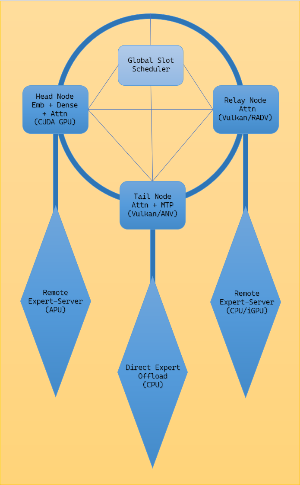

# Dreamcatcher: Architecture, Capabilities, and Design

> **An Architectural Metaphor for Distributed Heterogeneous Inference**  
> *In Ojibwe tradition, a dreamcatcher (*asabikeshiinh*, "spider web charm") is formed from a hoop of bent willow, an intricate woven string web with a central aperture, and soft feathers suspended by cords with beads. The hoop symbolizes unity and the circle of life; the woven web catches turbulence and bad dreams; and the central hole allows good visions to glide gently down the feathers to the sleeper below.*  
> 
> *In **Dreamcatcher**, this sacred structure maps to multi-host pipeline inference:*  
> - **The Hoop:** A closed **ring pipeline of GPU-attention knot nodes** (Head on NVIDIA CUDA, Relay on AMD RADV, and Tail on Intel ANV) partitioned into sequential stages.  
> - **The Woven Web:** The **low-latency TCP transport fabric** routing hidden activations and expert tensors between stages without central bottlenecks.  
> - **The Central Hole:** The **global slot router runtime** (`gslot-runtime`), arbitrating token slots and request concurrency across the pipeline.  
> - **The Feathers:** The **disaggregated remote-expert nodes** providing APU/CPU expert offload hanging from beaded cords. Activations circulate through the hoop's attention stages and route through expert feathers on demand, emitting verified token streams.

---

## 1. System Topology & Visual Metaphor

*Figure 1: The Dreamcatcher architecture. The hoop is a ring pipeline of three attention knot nodes — a Head node (embeddings, dense layers and attention on a CUDA GPU), a Relay node (attention on Vulkan/RADV) and a Tail node (attention and the MTP head on Vulkan/ANV) — woven together by the global slot router (labelled Global Slot Scheduler in the figure), which arbitrates request slots across the ring. The feathers are the expert paths hanging from each knot: a remote expert server on an APU, direct expert offload to the CPU, and a remote expert server on a CPU or integrated GPU. A detailed vector version of the same architecture is in [assets/dreamcatcher.svg](assets/dreamcatcher.svg).*

---

## 2. Core Capabilities Added to `ik_llama.cpp`

Upstream `llama.cpp` and `ik_llama.cpp` focus primarily on single-host or single-vendor acceleration. Dreamcatcher extends this foundation into an enterprise-ready distributed inference engine designed for mixed-hardware environments.

Below are the seven core technical capabilities built into Dreamcatcher, each detailing what it does, why it matters, and the authoritative documentation proving its implementation.

---

### 1. Multi-Host Stage-Runner Rings
- **What It Does:** Partitions a model's transformer layers across multiple sequential host processes (`head`, `relay`, and `tail` roles) linked in a pipeline ring. Intermediate activations flow forward between stages via low-latency TCP sockets over standard network interfaces.
- **Why It Matters:** Enables frontier-scale language models (30 GB to 150+ GB) to execute across separate physical workstations and servers without requiring proprietary multi-GPU interconnects (like NVLink) or complex MPI clusters.
- **Proof & Documentation:** [`docs/BRING-UP.md`](BRING-UP.md) §1 ("Architecture & Pipeline Topology").

---

### 2. Per-Layer Model Libraries (`--model-dir`, Slicing & Planner)
- **What It Does:** Replaces monolithic multi-gigabyte GGUF files with modular per-layer tensor packages. A model is sliced into individual block files accompanied by an explicit manifest. An automated planning utility calculates deterministic layer boundaries and memory requirements across cluster nodes.
- **Why It Matters:** Individual worker nodes only download, map into memory, and warm up the exact layer window assigned to them, reducing cold-start memory overhead from $O(\text{total model size})$ to $O(\text{assigned slice})$.
- **Proof & Documentation:** [`docs/BRING-UP.md`](BRING-UP.md) §0 ("Single-Process Serving: `llama-server --model-dir`") and §4 Step 1 ("Pre-Flight Stage Planning").

---

### 3. Single-Process Library Serving (`llama-server --model-dir`)
- **What It Does:** Enables standard `llama-server` and `llama-cli` executables to directly load and assemble a partitioned layer library from a local directory at runtime via `llama_model_load_from_parts()`, exposing standard OpenAI-compatible HTTP endpoints (`/v1/chat/completions`).
- **Why It Matters:** Eliminates pipeline overhead when a sliced model fits on a single host, allowing developers to use identical model libraries across both single-box and distributed deployments without re-converting weights.
- **Proof & Documentation:** [`docs/BRING-UP.md`](BRING-UP.md) §0 ("Single-Process Serving").

---

### 4. Expert Disaggregation (`llama-expert-server`)
- **What It Does:** Decouples the dense attention backbone from sparse Mixture-of-Experts (MoE) feed-forward blocks. The dense attention layers remain pinned in fast accelerator VRAM, while routed expert tensors are served over sockets by an independent `llama-expert-server` process residing on remote hosts or general system memory.
- **Why It Matters:** Unlocks massive MoE architectures (such as 64+ expert models) on cost-effective hardware by routing only the active top-K experts per token, allowing immense parameter capacity without enterprise VRAM footprints.
- **Proof & Documentation:** [`docs/EXPERT-SERVER-PORT.md`](EXPERT-SERVER-PORT.md) and [`docs/LANES-9-11.md`](LANES-9-11.md#lane-10-expert-server-port).

---

### 5. Global Slot Router Runtime Gate (`gslot-runtime`)
- **What It Does:** A centralized, configuration-driven compute-slot arbiter that gates pipeline stage runners (`llama-stage-runner`). It manages compute-slot lease acquisition, coordinates request scheduling across pipeline stages, and implements strict fail-open resilience.
- **Why It Matters:** Provides fair scheduling across concurrent inference workloads and protects pipelined stages from desynchronization, while strictly failing open so scheduling faults or daemon restarts never stall token generation.
- **Proof & Documentation:** [`docs/GSLOT-RUNTIME-PORT.md`](GSLOT-RUNTIME-PORT.md) and [`docs/LANES-9-11.md`](LANES-9-11.md#lane-11-gslot-runtime).

---

### 6. Multi-Vendor Heterogeneous Acceleration (Vulkan & CUDA)
- **What It Does:** Extends modern SPIR-V compute kernels and Vulkan flash-attention implementations to support Radeon (RDNA3/RDNA4 via RADV; token-exact on chat prompts) and Intel graphics devices (ANV; self-consistent) alongside CUDA in a unified build.
- **Why It Matters:** Breaks single-vendor GPU lock-in, enabling organizations to deploy inference pipelines across mixed hardware environments using their existing workstations and accelerators.
- **Proof & Documentation:** [`docs/VULKAN-BACKEND.md`](VULKAN-BACKEND.md) and [`docs/HF-MODEL-CARDS.md`](HF-MODEL-CARDS.md).
  *(Note on device compatibility: Hardware-specific behavior and active investigations—such as Intel ANV self-consistency vs CPU exactness, proprietary Vulkan ICD drift, or open DeepSeek-V4 Vulkan tracking under `meta#96`—are documented honestly in [`docs/KNOWN-ISSUES.md`](KNOWN-ISSUES.md) and [`docs/HF-MODEL-CARDS.md`](HF-MODEL-CARDS.md)).*

### 7. Mathematical Parity Verification & Release Integrity Suite
- **What It Does:** Implements rigorous automated verification harnesses that evaluate pipeline ring outputs token-by-token and logit-by-logit against monolithic un-partitioned baselines. Combines static Containerfile entrypoint checkers with dynamic token completion smoke verification (`ci/smoke-serve.sh`).
- **Why It Matters:** Verifies token-by-token and logit-level parity against monolithic baselines as a promotion gate, ensuring distributed multi-host partitioning maintains release integrity across target backends.
- **Proof & Documentation:** [`docs/RELEASE-INTEGRITY.md`](RELEASE-INTEGRITY.md).

---

## 3. Architecture & Operational Invariants

When deploying Dreamcatcher in production environments, four foundational operational rules govern cluster bring-up:

1. **Liveness Requires a Completion:** An HTTP 200 response on `/health` is an availability check, not a proof of generation. Liveness must always be validated with an end-to-end token completion stream.
2. **Feasibility vs. Runtime Proof:** Arithmetic VRAM allocation estimates from the planner confirm feasibility, but runtime stability is established only after surviving prompt prefill.
3. **Dynamic Layer Windows:** The layer slice assigned to each node is a process launch flag (`--layers <start>,<end>`), decoupled from immutable weight files.
4. **Persistent Hardware Identification:** Accelerators are pinned by persistent hardware UUIDs (`CUDA_VISIBLE_DEVICES=GPU-<uuid>`), never by volatile ordinal device indexes.